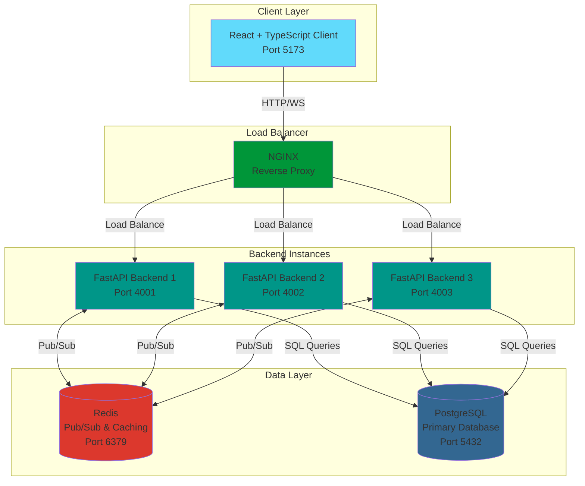
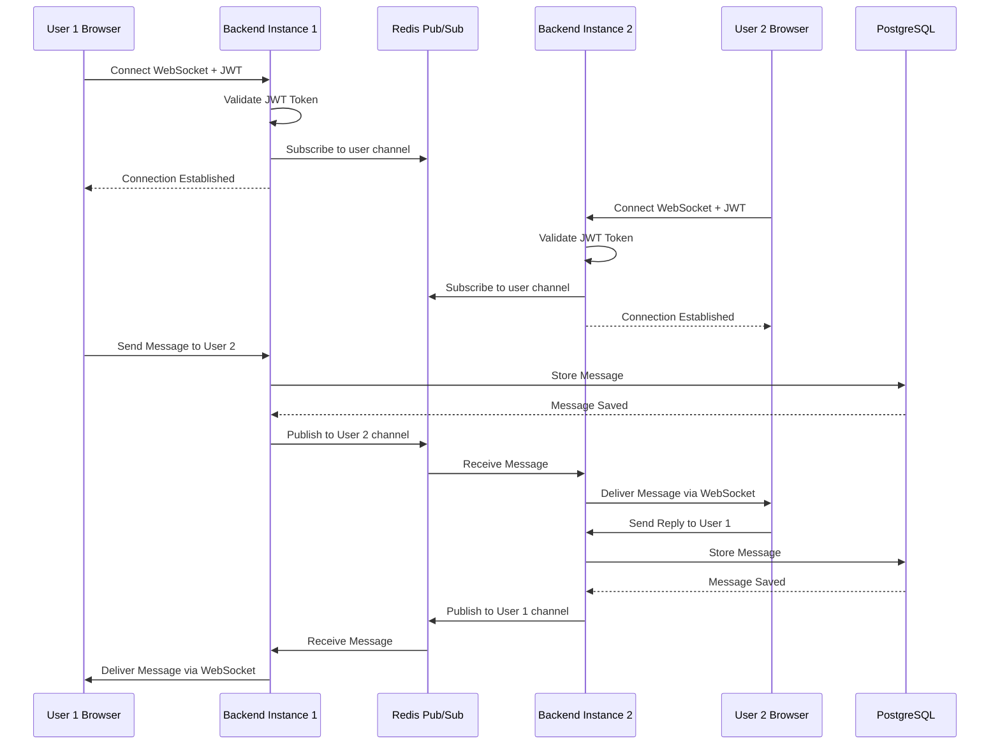

# FastAPI & WebSockets Learning - Real-Time Chat Application

A full-stack real-time chat application built with FastAPI, React, WebSockets, PostgreSQL, and Redis. This project demonstrates modern web application architecture with real-time communication, scalable backend design, and containerized deployment.

## 🌟 Features

- **Real-time Messaging**: WebSocket-based chat with instant message delivery
- **User Authentication**: JWT-based authentication with secure password hashing (Argon2)
- **Friend System**: Send/accept friend requests, manage friendships
- **User Discovery**: Find and connect with other users
- **Multi-Instance Backend**: Horizontally scalable backend with Redis pub/sub
- **Containerized Architecture**: Docker Compose for easy deployment
- **Modern Frontend**: React 19 with TypeScript, Redux Toolkit, and TailwindCSS
- **Type-Safe**: Full TypeScript support on frontend and Pydantic models on backend

## 🏗️ Architecture

### System Architecture Diagram



### WebSocket Communication Flow



## 🛠️ Tech Stack

### Backend

- **FastAPI**: Modern async Python web framework
- **WebSockets**: Real-time bidirectional communication
- **PostgreSQL**: Primary relational database
- **Redis**: Message broker for pub/sub and caching
- **asyncpg**: Async PostgreSQL driver
- **JWT**: Token-based authentication
- **Argon2**: Secure password hashing
- **Pydantic**: Data validation and settings management

### Frontend

- **React 19**: UI library
- **TypeScript**: Type-safe JavaScript
- **Vite**: Fast build tool
- **Redux Toolkit**: State management
- **React Query**: Server state management
- **React Router**: Client-side routing
- **TailwindCSS 4**: Utility-first CSS framework
- **Axios**: HTTP client

### DevOps

- **Docker**: Containerization
- **Docker Compose**: Multi-container orchestration
- **NGINX**: Reverse proxy and load balancer

## 📁 Project Structure

```
fast_api/
├── server/                 # FastAPI backend
│   ├── app/
│   │   ├── main.py        # Application entry point
│   │   ├── api/           # API routes
│   │   │   ├── auth.py    # Authentication endpoints
│   │   │   ├── friends.py # Friend management
│   │   │   ├── message.py # Message endpoints
│   │   │   └── websocket.py # WebSocket handler
│   │   ├── core/          # Core functionality
│   │   ├── db/            # Database models and connection
│   │   └── models/        # Pydantic models
│   ├── Dockerfile
│   └── requirements.txt
│
├── client/                # React frontend
│   ├── src/
│   │   ├── App.tsx        # Main app component
│   │   ├── components/    # React components
│   │   ├── api/           # API client functions
│   │   ├── hooks/         # Custom React hooks
│   │   ├── store/         # Redux store
│   │   └── types/         # TypeScript types
│   ├── package.json
│   └── vite.config.ts
│
├── nginx/                 # NGINX configuration
│   └── nginx.conf
│
├── docker-compose.yml     # Container orchestration
└── readme.md             # This file
```

## 🚀 Getting Started

### Prerequisites

- Docker and Docker Compose
- Node.js 18+ (for local frontend development)
- Python 3.11+ (for local backend development)

### Quick Start with Docker

1. **Clone the repository**

   ```bash
   git clone https://github.com/anuz505/fast-api-and-websockets-learning.git
   cd fast-api-and-websockets-learning
   ```

2. **Start all services**

   ```bash
   docker-compose up -d
   ```

3. **Access the application**
   - Backend instances:
     - http://localhost:4001
     - http://localhost:4002
     - http://localhost:4003
   - PostgreSQL: localhost:5432
   - Redis: localhost:6379

### Local Development

#### Backend Setup

1. **Create virtual environment**

   ```bash
   python -m venv myvenv
   myvenv\Scripts\activate  # Windows
   # source myvenv/bin/activate  # Linux/Mac
   ```

2. **Install dependencies**

   ```bash
   cd server/app
   pip install -r requirements.txt
   ```

3. **Set environment variables**
   Create `.env` file in `server/app/`:

   ```env
   POSTGRES_HOST=localhost
   POSTGRES_PORT=5432
   POSTGRES_USER=postgres
   POSTGRES_PASSWORD=postgres
   POSTGRES_DB=chat-app
   REDIS_HOST=localhost
   REDIS_PORT=6379
   SECRET_KEY=your-secret-key-here
   ```

4. **Run the server**
   ```bash
   uvicorn main:app --reload --port 8000
   ```

#### Frontend Setup

1. **Install dependencies**

   ```bash
   cd client
   npm install
   ```

2. **Start development server**

   ```bash
   npm run dev
   ```

3. **Access the app**
   - Open http://localhost:5173

## 📡 API Endpoints

### Authentication

- `POST /api/auth/register` - Register new user
- `POST /api/auth/login` - Login and get JWT token
- `GET /api/auth/me` - Get current user info

### Friends

- `GET /api/friends` - Get user's friends
- `POST /api/friends/request` - Send friend request
- `POST /api/friends/accept` - Accept friend request
- `GET /api/friends/suggestions` - Get friend suggestions
- `GET /api/friends/requests` - Get pending friend requests

### Messages

- `GET /api/messages/{user_id}` - Get conversation with user
- `POST /api/messages` - Send a message

### WebSocket

- `WS /ws` - WebSocket connection for real-time messaging
  - First message must be auth: `{"type": "auth", "content": "JWT_TOKEN"}`

## 🔐 Authentication Flow

1. User registers or logs in via REST API
2. Server validates credentials and returns JWT token
3. Client stores token (localStorage/sessionStorage)
4. For WebSocket connection, client sends token in first message
5. Server validates token and associates connection with user
6. All subsequent messages are authenticated

## 🌐 Real-Time Messaging

The application uses WebSockets for real-time communication:

1. **Connection**: Client connects and authenticates via WebSocket
2. **Redis Pub/Sub**: Each backend instance subscribes to Redis channels
3. **Message Flow**:
   - User sends message via WebSocket
   - Backend stores in PostgreSQL
   - Backend publishes to Redis channel
   - All instances receive the message
   - Target instance delivers to recipient

This architecture allows horizontal scaling with multiple backend instances.

## 🧪 Testing

### Backend Tests

```bash
cd server/app
pytest
```

### Frontend Tests

```bash
cd client
npm test
```

## 📦 Docker Services

The application runs 5 main services:

1. **postgres** - PostgreSQL database
2. **redis** - Redis for pub/sub and caching
3. **backend1, backend2, backend3** - Three FastAPI instances for horizontal scaling
4. **nginx** - Load balancer (configure if needed)

## 🔧 Configuration

### Backend Configuration

Edit `server/app/core/config.py` for application settings

### Frontend Configuration

Edit `client/vite.config.ts` and environment variables

### Docker Configuration

Edit `docker-compose.yml` to adjust services, ports, or resources

## 🤝 Contributing

1. Fork the repository
2. Create a feature branch (`git checkout -b feature/amazing-feature`)
3. Commit your changes (`git commit -m 'Add amazing feature'`)
4. Push to the branch (`git push origin feature/amazing-feature`)
5. Open a Pull Request

## 📝 License

This project is open source and available for learning purposes.

## 👤 Author

**Anuj Bhandari**

- GitHub: [@anuz505](https://github.com/anuz505)

## 🙏 Acknowledgments

- FastAPI documentation and community
- React and TypeScript communities
- Redis and PostgreSQL teams
- Docker and containerization best practices

## 📚 Learning Resources

This project demonstrates:

- WebSocket implementation in FastAPI
- React with TypeScript and modern hooks
- Redis pub/sub pattern for distributed systems
- Docker Compose for multi-container applications
- JWT authentication
- Async Python with asyncpg
- State management with Redux Toolkit

---

**Happy Coding! 🚀**
